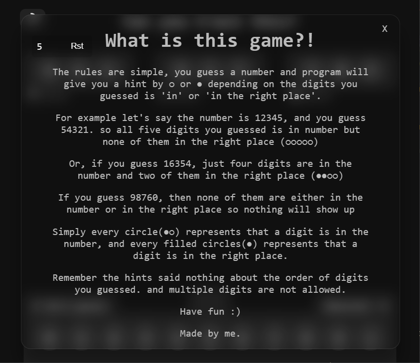

# Crack the code

Can you crack the code?

<figure style="display:block;text-align:center">

</figure>

### Game rules:

<figure class="post-figure">

</figure>
also, it runs on https://erfanpaslar.ir/crack-it

UPDATE:

I've made the python version that's on `python-version` branch.

install eel library using `pip install eel` the run the `crack.py` file.
