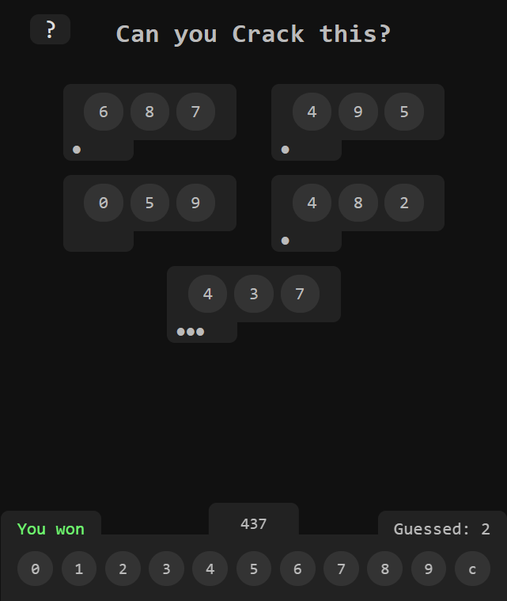
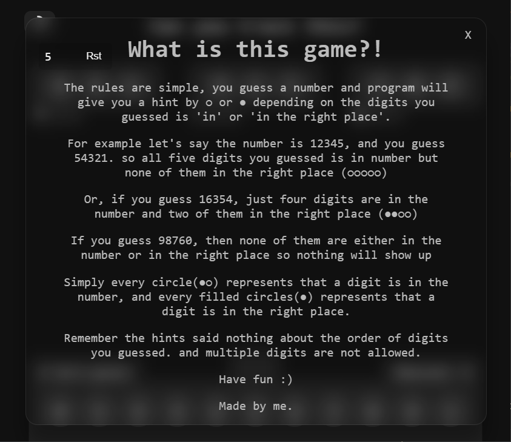

# Crack the code

Can you crack the code?

<figure class="post-figure">

</figure>

install eel library using `pip install eel` the run the `crack.py` file.

### Game rules:

<figure class="post-figure">

</figure>

UPDATE:

I've made the none python version that's in `No py` folder.

also, it runs on https://erfanpaslar.ir/crack
